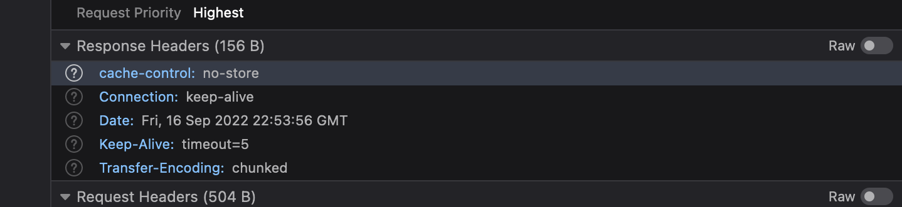

# no-client-example

an example of using http browsing caching with no client.

## Set up

This simple server requires http-server to be installed

In the terminal:

1. run: `node index.mjs`
2. then in browser: go to: `http://localhost:3000/`

### The Home page example

> sets cache control to store for 10 seconds using an etag.

### The page 1 example

> sets cache control to not store data.

