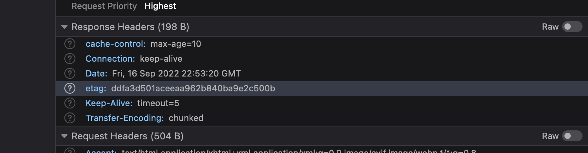

# No Client Example

- An example of using http browsing caching with no client.
- The code was created from this [video](https://www.youtube.com/watch?v=3XkU_DXcgl0&ab_channel=Remix)
- And uses the [http server](https://nodejs.dev/en/learn/build-an-http-server/ ) provided by Node.js.

## Set up

In the terminal:

0. clone this repo  `git clone git@github.com:jpvajda/no-client-example.git`
1. run: `node index.mjs`
2. then in browser: go to: `http://localhost:3000/`

### The Home page example

> sets cache control to store for 10 seconds using an etag.

### The page 1 example

> sets cache control to not store data.

